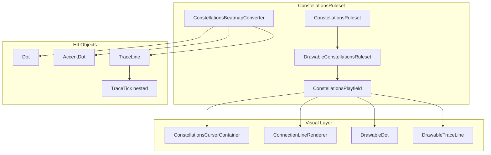

# Constellations Ruleset для osu!lazer

## Контекст и решения

- **Шаблон**: [`ruleset-empty`](Templates/Rulesets/ruleset-empty/osu.Game.Rulesets.EmptyFreeform/) — freeform 2D playfield (как osu! standard).
- **Карты (v1)**: конвертация из osu! standard; собственный формат — отдельная фаза позже.
- **Режимы**:
  - **Обычный**: клик (Z/X) + курсор в `HitRadius` в окне тайминга.
  - **Aim-only** (`ConstellationsModRelax`): только наведение; auto-hit при попадании курсора в радиус (паттерн [`OsuModRelax`](osu.Game.Rulesets.Osu/Mods/OsuModRelax.cs)).

## Архитектура



## Структура проекта

Сгенерировать через `dotnet new ruleset -n Constellations`, добавить в [`osu.sln`](osu.sln) и [`osu.Desktop.csproj`](osu.Desktop/osu.Desktop.csproj) для dev-итерации:

```
osu.Game.Rulesets.Constellations/
├── ConstellationsRuleset.cs
├── ConstellationsInputManager.cs          // ConstellationsAction { LeftButton, RightButton }
├── Beatmaps/ConstellationsBeatmapConverter.cs
├── Objects/
│   ├── ConstellationsHitObject.cs         // базовый: HitWindows, TimePreempt
│   ├── Dot.cs / AccentDot.cs
│   ├── TraceLine.cs                       // IHasPath, IHasDuration
│   ├── TraceTick.cs                       // nested для continuous scoring
│   └── Drawables/
│       ├── DrawableConstellationsHitObject.cs
│       ├── DrawableDot.cs / DrawableAccentDot.cs
│       ├── DrawableTraceLine.cs
│       ├── TraceLineInputManager.cs       // адаптация SliderInputManager
│       └── Components/                    // DotPiece, TimingRing, HitExplosion
├── UI/
│   ├── DrawableConstellationsRuleset.cs
│   ├── ConstellationsPlayfield.cs
│   ├── ConstellationsCursorContainer.cs   // полое кольцо + trail
│   └── ConnectionLineRenderer.cs          // анимированные линии между точками
├── Judgements/ + Scoring/
├── Mods/ConstellationsModRelax.cs, ConstellationsModAutoplay.cs
├── Replays/
└── ConstellationsDifficultyCalculator.cs
```

---

## Фаза 1 — Скaffold и базовый геймплей

### 1.1 Ruleset entry point

По образцу [`EmptyFreeformRuleset.cs`](Templates/Rulesets/ruleset-empty/osu.Game.Rulesets.EmptyFreeform/EmptyFreeformRuleset.cs):

- `ShortName = "constellations"`, `Description = "Constellations"`
- `RulesetAPIVersionSupported => CURRENT_RULESET_API_VERSION`
- `GetModsFor()`: Relax, Autoplay, стандартные DT/HR/EZ где применимо

### 1.2 Hit Windows и Judgements

```csharp
// Perfect / Great / Good / Miss — аналог 300/100/50/miss
public class ConstellationsHitWindows : HitWindows
{
    public override bool IsValidResult(HitResult result) => ...
}
```

- `DotJudgement` / `AccentDotJudgement` — `AccentDot` с множителем очков (например ×1.5).
- `TraceTickJudgement` — для непрерывной оценки на TraceLine.

### 1.3 Dot / AccentDot — логика попадания

**Логика** (`Dot.cs`):
- `IHasPosition`, `IHasComboInformation`, `IHasTimePreempt`
- `HitRadius` — радиус попадания (константа ruleset или CS-зависимая)
- `CreateJudgement()` → `DotJudgement`

**Drawable** (`DrawableDot.cs`) — по образцу [`DrawableHitCircle`](osu.Game.Rulesets.Osu/Objects/Drawables/DrawableHitCircle.cs):

| Режим | `CheckForResult` |
|-------|------------------|
| Обычный (`userTriggered=true`) | Клик + расстояние курсора ≤ `HitRadius` + `HitWindows.CanBeHit(timeOffset)` |
| Auto-miss (`userTriggered=false`) | Если окно истекло и не judged → Miss |

**Проверка попадания курсора** — не через `HitReceptor.IsHovered`, а через расстояние от `Playfield.Cursor.ActiveCursor` до центра точки (курсор — кольцо, попадание = центр точки внутри кольца):

```csharp
float dist = Vector2.Distance(cursorPosition, HitObject.StackedPosition);
bool inRadius = dist <= HitObject.HitRadius - dotRadius; // точка «видна в центре кольца»
```

### 1.4 ConstellationsModRelax (aim-only)

Паттерн [`OsuModRelax`](osu.Game.Rulesets.Osu/Mods/OsuModRelax.cs):

- `IUpdatableByPlayfield`, `IApplicableToDrawableRuleset<ConstellationsHitObject>`, `IApplicableToPlayer`
- Отключает ручной ввод кликов (`AllowGameplayInputs = false`)
- Каждый кадр: сканирует `AliveObjects`, если курсор в `HitRadius` и `CanBeHit` → вызывает `UpdateResult(true)` на drawable
- Для TraceLine: auto-tracking через `TraceLineInputManager` без клика на head

---

## Фase 2 — TraceLine (слайдер)

### 2.1 Логика

По образцу [`Slider.cs`](osu.Game.Rulesets.Osu/Objects/Slider.cs) + [`SliderInputManager.cs`](osu.Game.Rulesets.Osu/Objects/Drawables/SliderInputManager.cs):

- `TraceLine : ConstellationsHitObject, IHasPath, IHasDuration`
- Переиспользовать `SliderPath` / `PathControlPoint` из osu.Game
- `CreateNestedHitObjects()` → генерирует `TraceTick` с интервалом (аналог slider ticks)
- Конвертация: osu `Slider` → `TraceLine` с тем же path и duration

### 2.2 Continuous scoring

- `TraceLineInputManager` — проверяет `IsMouseInFollowArea()` каждый кадр (расстояние курсора до `CurvePositionAt(progress)` ≤ follow radius)
- Nested `TraceTick` judged hit/miss по tracking state
- Head (`TraceLineStart`) — judged как Dot (клик + aim в обычном режиме)

---

## Фаза 3 — Визуал

### 3.1 Курсор — полое кольцо

[`ConstellationsCursorContainer`](Templates/Rulesets/ruleset-example/osu.Game.Rulesets.Pippidon/UI/PippidonCursorContainer.cs) extends `GameplayCursorContainer`:

```
ConstellationsCursor (Drawable)
├── Ring (Circle с FillAlpha=0, thick Border)
├── Optional CursorTrail (короткий шлейф, как DefaultCursorTrail)
└── InnerMask — точки рендерятся «внутри» через z-order / clipping
```

Регистрация в [`ConstellationsPlayfield.CreateCursor()`](osu.Game/Rulesets/UI/Playfield.cs).

### 3.2 Dot visuals

| Состояние | Поведение |
|-----------|-----------|
| Неактивная | Тусклый контур (`AccentColour` с alpha ~0.3) |
| Активная (в окне) | Яркая, пульсация scale, `TimingRing` — сужающееся кольцо (как `DefaultApproachCircle`) |
| Hit | `HitExplosion` flash → `FadeOut` |
| Miss | `FadeColour(Red/Grey)` → `FadeOut` |

Реализация в `UpdateHitStateTransforms()` + `Update()` для пульсации активных точек.

### 3.3 ConnectionLineRenderer

Отдельный `CompositeDrawable` на playfield (не hit object):

- Подписывается на combo-ordered hit objects из beatmap
- Между каждой парой `(prev, next)` рисует `Path`/`Line` с gradient (направление = от prev к next)
- Анимация: `drawProgress` от 0→1 по времени (линия «рисуется» к следующей точке)
- После hit на prev — сегмент затухает (`FadeOut`)
- Для TraceLine — линия совпадает с path объекта (reuse curve)

---

## Фаза 4 — Beatmap Converter

[`ConstellationsBeatmapConverter`](Templates/Rulesets/ruleset-empty/osu.Game.Rulesets.EmptyFreeform/Beatmaps/EmptyFreeformBeatmapConverter.cs):

| osu! object | Constellations object |
|-------------|----------------------|
| `HitCircle` | `Dot` |
| `HitCircle` на сильной доле* | `AccentDot` |
| `Slider` | `TraceLine` (path + duration + ticks) |
| `Spinner` | пропуск или несколько `Dot` по окружности |

\*Heuristic для AccentDot v1: объект на `(timingPoint beat)` с `SampleSet` содержащим `-large`/`whistle`, или каждый N-й объект в combo.

`CanConvert()` → `Beatmap.HitObjects.Any(h => h is IHasPosition)`.

---

## Фаза 5 — Replays, Difficulty, Tests

### Replays
- `ConstellationsReplayFrame`: позиция курсора + pressed actions
- `ConstellationsFramedReplayInputHandler` + `ConstellationsAutoGenerator` для autoplay

### Difficulty Calculator
- Базовая эвристика: aim strain (расстояния между точками), density, TraceLine length
- Наследование от `DifficultyCalculator` по образцу Catch/Pippidon

### Tests
- `osu.Game.Rulesets.Constellations.Tests` из шаблона
- `TestSceneDotJudgement`, `TestSceneTraceLineTracking`, `TestSceneConnectionLines`
- Conversion test с sample `.osu` beatmap

---

## Ключевые файлы-референсы

| Задача | Референс |
|--------|----------|
| Ruleset skeleton | [`EmptyFreeformRuleset`](Templates/Rulesets/ruleset-empty/osu.Game.Rulesets.EmptyFreeform/) |
| Click + aim judgement | [`DrawableHitCircle.CheckForResult`](osu.Game.Rulesets.Osu/Objects/Drawables/DrawableHitCircle.cs) |
| Slider path tracking | [`SliderInputManager`](osu.Game.Rulesets.Osu/Objects/Drawables/SliderInputManager.cs) |
| Relax mod | [`OsuModRelax`](osu.Game.Rulesets.Osu/Mods/OsuModRelax.cs) |
| Custom cursor | [`PippidonCursorContainer`](Templates/Rulesets/ruleset-example/osu.Game.Rulesets.Pippidon/UI/PippidonCursorContainer.cs) |
| Playfield wiring | [`DrawablePippidonRuleset`](Templates/Rulesets/ruleset-example/osu.Game.Rulesets.Pippidon/UI/DrawablePippidonRuleset.cs) |

---

## Порядок реализации (MVP → polish)

1. Scaffold проекта + wiring в solution/desktop
2. `Dot` + `DrawableDot` + hit windows + обычный режим (клик + aim)
3. `ConstellationsCursorContainer` (кольцо)
4. `ConstellationsModRelax`
5. `ConstellationsBeatmapConverter` (HitCircle → Dot)
6. `ConnectionLineRenderer` (базовая анимация)
7. `TraceLine` + continuous tracking
8. `AccentDot` + визуальные polish (пульсация, flash, fade)
9. Replays, difficulty, tests

## Будущее (вне MVP)

- Собственный формат beatmap с явными типами `Dot` / `AccentDot` / `TraceLine`
- Editor blueprints для Constellations objects
- Skinning support
